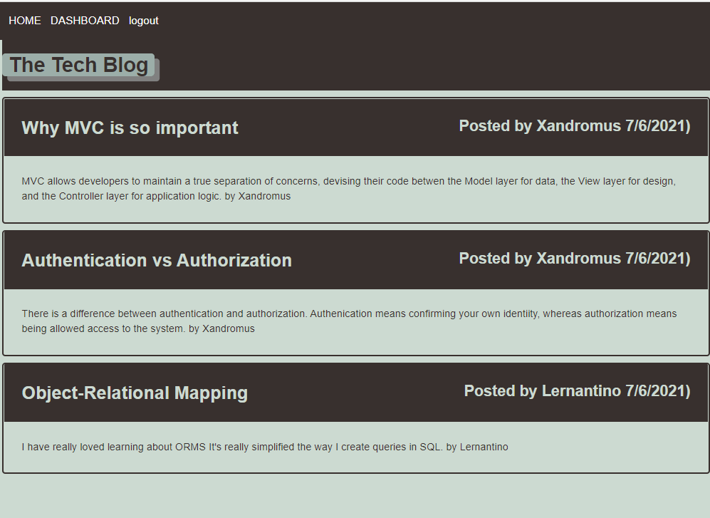

# Yet Another Portfolio

## Description
Portfolio of the web pages I programmed myself or as part of a team. I used MaterializeCSS for this page. It is supposed to be mobile responsive but there is some fixup needed.

## Installation
This web page has a single html file, a single css file and a single js file. MaterialCSS and jQuery are linked with the CDN website, <cdnjs> (https://cdnjs.com). No APIs are used.
 
 
GitHub pages: https://minprocess.github.io/yet-another-portfolio/
 
GitHub repo: https://github.com/minprocess/yet-another-portfolio

## Usage

 

## Credits

## License
Copyright (c) [2021] [William T Pate]

Permission is hereby granted, free of charge, to any person obtaining a copy
of this software and associated documentation files (the "Software"), to deal
in the Software without restriction, including without limitation the rights
to use, copy, modify, merge, publish, distribute, sublicense, and/or sell
copies of the Software, and to permit persons to whom the Software is
furnished to do so, subject to the following conditions:

The above copyright notice and this permission notice shall be included in all
copies or substantial portions of the Software.

THE SOFTWARE IS PROVIDED "AS IS", WITHOUT WARRANTY OF ANY KIND, EXPRESS OR
IMPLIED, INCLUDING BUT NOT LIMITED TO THE WARRANTIES OF MERCHANTABILITY,
FITNESS FOR A PARTICULAR PURPOSE AND NONINFRINGEMENT. IN NO EVENT SHALL THE
AUTHORS OR COPYRIGHT HOLDERS BE LIABLE FOR ANY CLAIM, DAMAGES OR OTHER
LIABILITY, WHETHER IN AN ACTION OF CONTRACT, TORT OR OTHERWISE, ARISING FROM,
OUT OF OR IN CONNECTION WITH THE SOFTWARE OR THE USE OR OTHER DEALINGS IN THE
SOFTWARE.

## Tests
Click on links. Do they work? 
Click on link to web page on a phone. Does the menu work? 